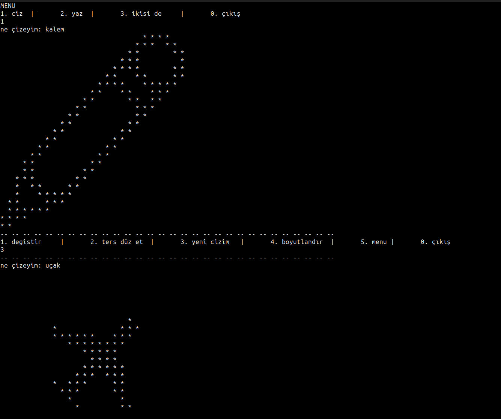
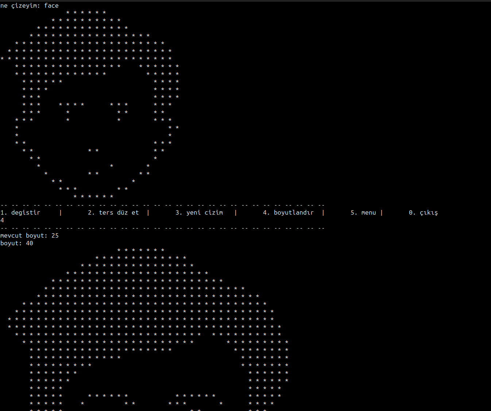
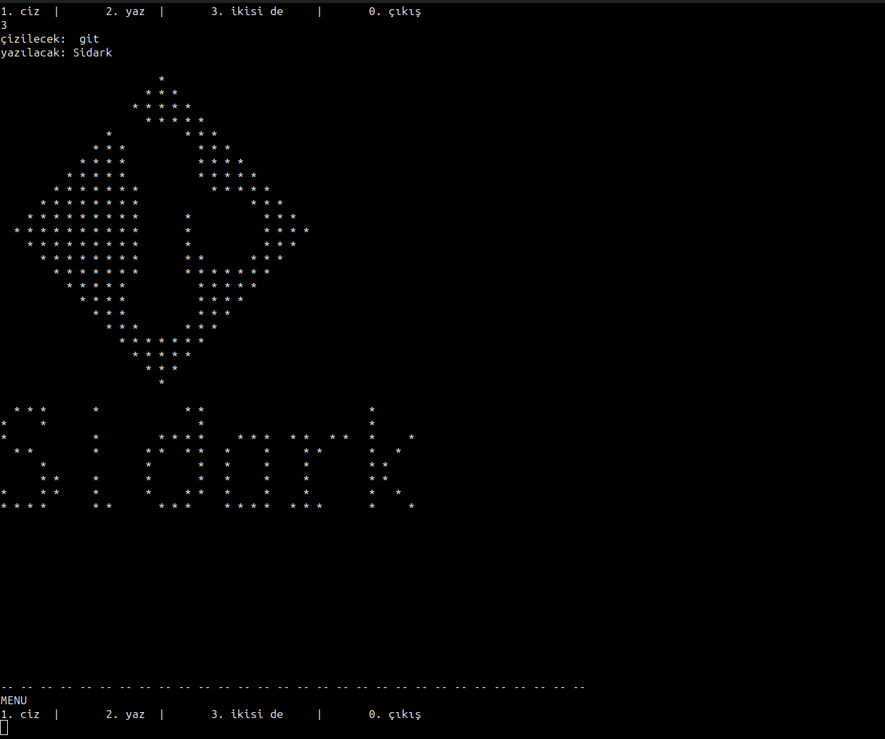

# ASCII Art Program

Bu program, kullanıcının girdiği bir metne dayanarak ASCII sanatını oluşturur veya belirlenen bir font kullanarak metni ASCII sanatı haline getirir.

## Kullanım

1. ```
   git clone https://github.com/sidarpttr/ascii-art-generator.git
   ```
2. Programı çalıştırın:
    ```
    python main.py
    ```
3. Program size bir menü sunacaktır. Menüden bir seçenek seçin:
    - "ciz" seçeneği: Bir prompt girdikten sonra bir simgeyi çizer.
    - "yaz" seçeneği: Bir prompt girdikten sonra belirli bir font ile metni ASCII sanatına dönüştürür.
    - "ikisi de" seçeneği: Hem simgeyi çizer hem de belirli bir font ile metni ASCII sanatına dönüştürür.
    - "çıkış" seçeneği: Programı sonlandırır.

## Örnekler
### Icon çizdirme


### Boyutlandırma


### yazı yazdırma


`fonts` klasöründe yazı fontu dosyası ekleyip yeni fontlarla yazı yazdırılabilir.
`search.py` dosyasındaki `font_family` değişkeninden fontlara erişilebilir.

